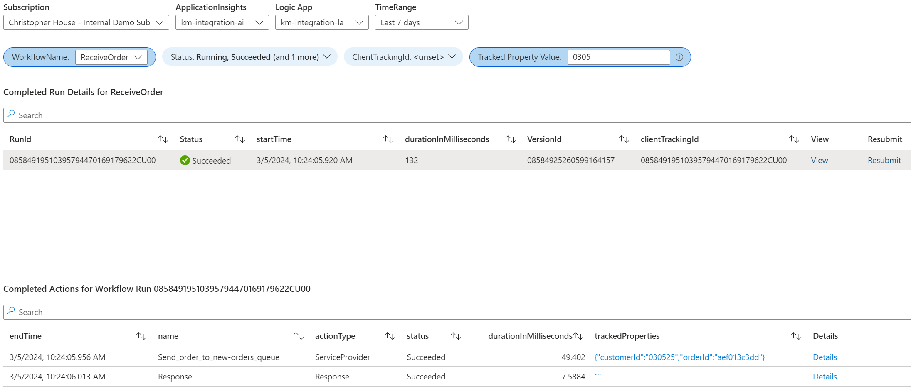

# Logic Apps Standard Workflow Run Monitoring

This repository contains an updated Azure Monitor Workbook template based on the work started in [this blog post about using Azure Logic Apps enhanced App Insights telemetry capability](https://techcommunity.microsoft.com/t5/azure-integration-services-blog/extending-logic-apps-app-insight-integration-with-azure/ba-p/3784062).  The workbook from the blog posts allows customers to search workflow history for a specific Logic App/Workflow, including the ability to filter by a custom tracking ID.  The query results can display tracked properties from actions contained in workflow runs, but it provide the ability to filter by tracked property values.  This repository provides an updated version of the Workbook template shared in the blog post above.  The updated version adds a filter for Tracked Property Value.  If a value is supplied for this filter, the query will limit workflow runs to only those that have at least one action with *any* tracked property value.  This approach takes the conviencce of being able to search all Tracked Properties without needing to know their names over more efficient querying for specific Tracked Property Names.

## Logic Apps Enhanced Application Insights Telemetry
The queries in this workbook depend on the data collected by the enhanced Application Insights telemetry feature for Logic Apps. This feature must be enalbed in your `host.json` file.  For more information on this feature, see the [official documentation](https://learn.microsoft.com/en-us/azure/logic-apps/enable-enhanced-telemetry-standard-workflows?tabs=portal).



## Deployment

To deploy the ARM template, you can use the Azure CLI, PowerShell, or the Azure portal. Here's an example using the Azure CLI:

```sh
az deployment group create --name ExampleDeployment --resource-group ExampleGroup --template-file ./infrastructure/main.json --parameters workbookDisplayName="My Workbook" workbookType="workbook" workbookSourceId="azure monitor" workbookId="unique-id"
```

Replace `ExampleDeployment` with the name you want to give to this deployment, `ExampleGroup` with the name of your resource group.  The template parameters all have default value, so you only need to supply a value if you want to override the default.

## Parameters

The `main.json` ARM template supports the following parameters:

| Parameter | Type | Default Value | Description |
| --- | --- | --- | --- |
| `workbookDisplayName` | string | "Logic App Run History Workbook" | The friendly name for the workbook that is used in the Gallery or Saved List. This name must be unique within a resource group. |
| `workbookType` | string | "workbook" | The gallery that the workbook will be shown under. Supported values include workbook, tsg, etc. Usually, this is 'workbook'. |
| `workbookSourceId` | string | "azure monitor" | The id of resource instance to which the workbook will be associated. |
| `workbookId` | string | "[newGuid()]" | The unique guid for this workbook instance. |

Please note that the `workbookId` parameter is generated by default using the `newGuid()` function. If you want to provide a specific ID, you can do so by providing a value for this parameter in your parameters file.

## License

This project is licensed under the MIT License. For more details, see the [`LICENSE`](command:_github.copilot.openRelativePath?%5B%22LICENSE%22%5D "LICENSE") file.